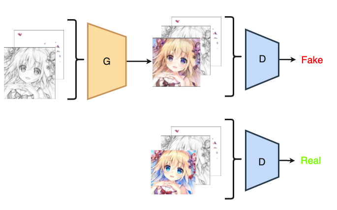
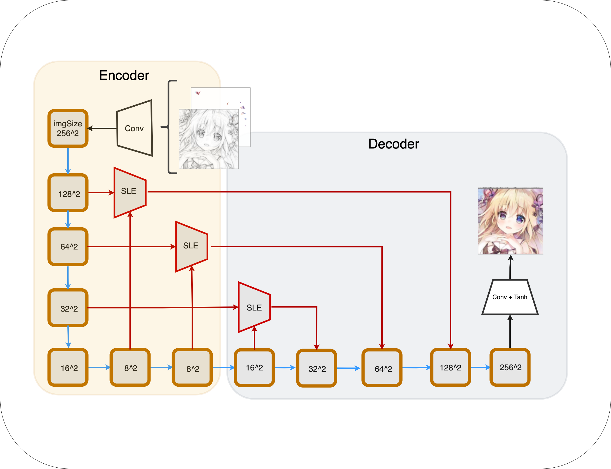
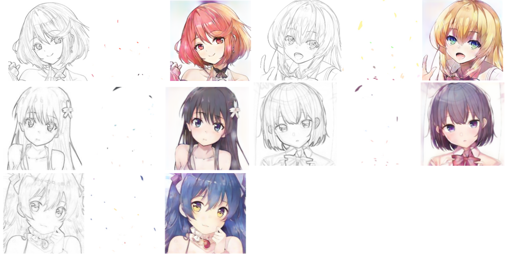
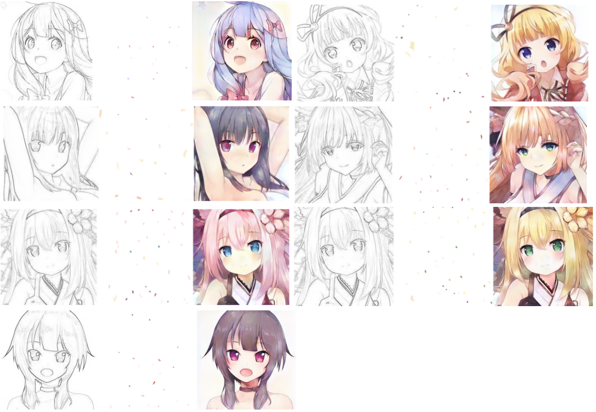
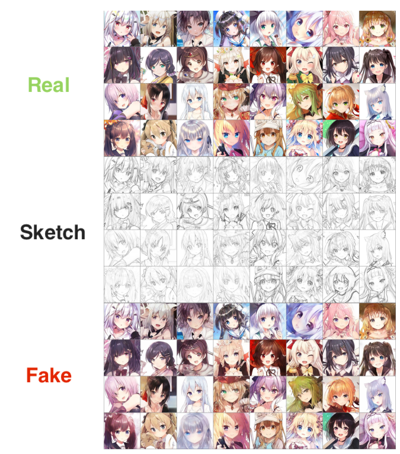

# AnimeFace pix2pix with color hint

In this repository, we have experimented with automatic colorization with color hint of line drawings of anime faces([AnimeFace datasets](https://www.kaggle.com/scribbless/another-anime-face-dataset)) using U-Net and GAN-based networks conbine skip-layer exicitation (SLEblock).

__[Read more about this here.](https://imoken1122.hatenablog.com/entry/2021/06/03/173235?_ga=2.97286879.1198031966.1622637948-753262940.1617945793)__

<br>
<div align="center">
  

</div>  

<br>

<p align="center">Fig.1 : model overview</p>

<br>

<div align="center">
  
</div>  

  
  
<p align="center">　Fig.2 : Generator overview (SLE U-Net)</p>

<br>

  

## Requirements
- Python, numpy
- PyTorch
- torchvision


## Usage


### 1. Train the model


The first argument is the path to the dataset containing the images `--input_path` 

The dataset directory structure should look like this
```
<img_dir>
 |
 |>train
 |
 |>test
```

Also, Specify the name of the directory where the learning logs `--model_name`
will be stored.
<br>

Let's start learning   
ex.
```
$ python run.py --input_path datasets --model_name first_model --isTrain --sle 
```
<br>


If you want to resume learning,  specify the `--model_name`  where the log is kept.  

And if you want to specify the epoch to be resumed, give the arguments `--continue_train` and `--which_epoch <epoch>`.

ex.
```
$ python run.py --input_path datasets --model_name first_model  --isTrain --sle  --continue_train --which_epoch 10
```

<br>

To resume with the latest model, give the argument `--continue_train_latest`

ex.
```
$ python run.py --input_path datasets --model_name first_model  --isTrain --sle  --continue_train_latest
```

<br>

### 2. Generate a colored image.

In the paint directory, put the original image in "full", and put the image (256x256×3,bachgroundColor is white (255)) that you specified as a color hint in "ref".

Specify the model name to use for inference and the number of epochs where the model is saved (G_{epoch}.pth)  

let's Generate a colored image.

ex.
```
$ python test.py --model_name first_model --which_epoch 10 --sle
```

## Result

The following is the result of automatic color generation when I input the line drawing of the train and test data and the color hint I specified into the generator., which has been trained up to Epoch 26 and 20,000 images were used for training.

From right to left, Sketch, Self-specified color hints, Auto colorize generated image.  


  


__<p align="center">Fig3: Automatic coloring using human color hints and line drawings as input to the Generator (train data)</p>__


<br>

  


__<p align="center">Fig4: Automatic coloring using human color hints and line drawings as input to the Generator (test data)</p>__


<br>
<br>

The following are the results of the automatic color generation when the line drawings of the training and test data and the color hints from the circle mask (i.e. the color hints used for training) are input to the generator.
  

  


__<p align="center">Fig4: Automatic coloring using CircleMask color hints and line drawings as input to the Generator (train and test data)</p>__
